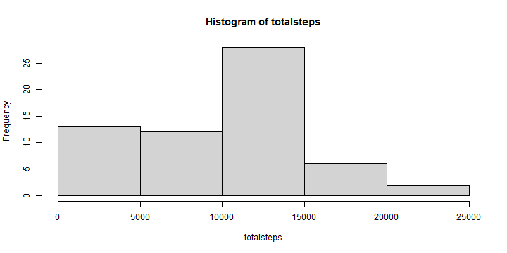
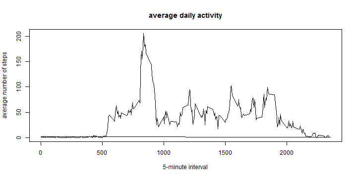
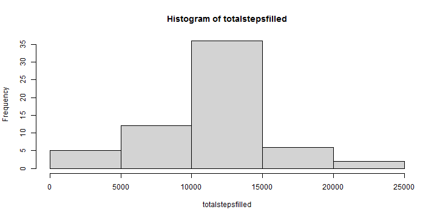
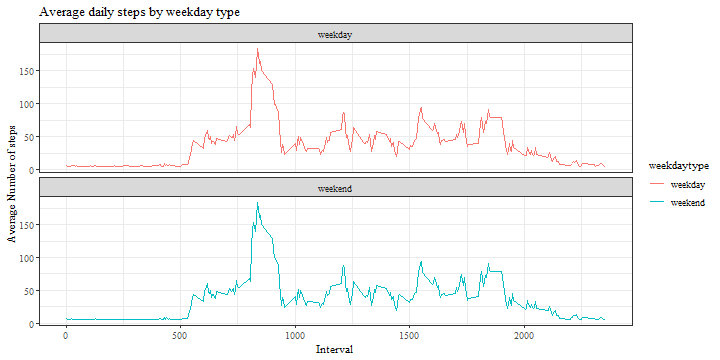

## Loading and preprocessing the data
1. Loading packaging  

```r
library(dplyr)
```

```
## 
## Attachement du package : 'dplyr'
```

```
## Les objets suivants sont masqués depuis 'package:stats':
## 
##     filter, lag
```

```
## Les objets suivants sont masqués depuis 'package:base':
## 
##     intersect, setdiff, setequal, union
```

```r
library(ggplot2)
```

```
## Use suppressPackageStartupMessages() to eliminate package startup messages
```

2. Load data  
let's first dzip the file  

```r
path = getwd()
dfile <- unzip("activity.zip")  
```
 Then read data activity

```r
activity <- read.csv(dfile,sep = ",")
```

2. Processing data in right format  

```r
activity$date <- as.Date(activity$date)
```


## 1. What is mean total number of steps taken per day?
1. Calculate the total number of steps taken per day  

```r
totalsteps <- tapply(activity$steps, activity$date, sum, na.rm=T)
```

Making a histogram of the total number of steps taken each day  

```r
hist(totalsteps)
```



### 2. Calculate and report the mean and median of the total number of steps taken per day  

Mean of the total number of steps per day  

```r
mean(totalsteps, na.rm = T)
```

```
## [1] 9354.23
```

Median of the total number of steps per day  

```r
median(totalsteps, na.rm = T)
```

```
## [1] 10395
```


## 2. What is the average daily activity pattern?
### 1. Make a time series plot (i.e. type = "l") of the 5-minute interval (x-axis)
### and the average number of steps taken, averaged across all days (y-axis) 
calculating avg number of steps taken by interval  

```r
activity$moysteps <- tapply(activity$steps, activity$interval, mean, na.rm=T)
```

Then making time series plot  of the the 5-minute interval and the average number of steps taken, averaged across all days 

```r
activity$tser <- ts(activity$interval, 
                    start = 1, end = 17568)
```


```r
with(activity, plot.ts(tser, moysteps, type = "l", 
                    main ="average daily activity" ,xlab = "5-minute interval",
                    ylab = "average number of steps"))
```


  
### 2.	Which 5-minute interval, on average across all the days in the dataset,   contains the maximum number of steps?  


```r
filter(activity,moysteps == max(moysteps)) %>%
                     select(interval) %>% unique
```

```
##   interval
## 1      835
```


## 3. Imputing missing values
### Calculating and reporting the total number of missing values in the dataset  

```r
sum(is.na(activity))
```

```
## [1] 2304
```

### Then, Devising a strategy to fill in all of the missing values in the dataset.     
making a copy of dataset which we are going to replace steps column NAs by mean  

```r
activity2fill = activity
```

Replacing NAs in steps column with mean:  

```r
activity2fill$steps[is.na(activity2fill$steps)] = 
mean(activity2fill$steps,na.rm = T)
```

### Creating a new dataset that is equal to the original dataset but with the missing data filled in.  

```r
activityfilled = activity2fill
```

1. Calculate the total number of steps with NAs filled by mean taken per day  

```r
totalstepsfilled <- tapply(activityfilled$steps, activityfilled$date, sum, na.rm=T)
```
## 4. Make a histogram of the total number of steps taken each day and Calculate and report the mean and median total number of steps taken per day.  

Making a histogram of the total number of steps with NAs filled by mean taken each day  

```r
hist(totalstepsfilled)
```



### 2. Calculate and report the mean and median of the total number of steps with NAs filled by mean taken per day  

Mean of the total number of steps per day  

```r
mean(totalstepsfilled, na.rm = T)
```

```
## [1] 10766.19
```

Median of the total number of steps per day  

```r
median(totalstepsfilled, na.rm = T)
```

```
## [1] 10766.19
```


## 5. Are there differences in activity patterns between weekdays and weekends?  
### 1. Create a new factor variable in the dataset with two levels – “weekday”
and “weekend” indicating whether a given date is a weekday or weekend
day.  

```r
activityfilled = mutate(activityfilled, weekday = as.factor(weekdays(date)))
```
Creating a function that are going to be use to replace weekdays by "weekend" and "weekday":

```r
fun2replace = function(x){if (x == "samedi" | x =="dimanche") {
        y = "weekend"
} else {y = "weekday"}}
```


```r
activityfilled$weekdaytype = as.factor(sapply(activityfilled$weekday,
                                              fun2replace))
```


### 2. Make a panel plot containing a time series plot (i.e. type = "l") of the 5-minute interval (x-axis) and the average number of steps taken, averaged
across all weekday days or weekend days (y-axis). The plot should look
something like the following, which was creating using simulated data:

calculating avg number of steps taken by weekday and weekend days  

```r
activityfilled$moysteps <- tapply(activityfilled$steps, activityfilled$interval, mean, na.rm=T)
```

Then making time series plot  of the the 5-minute interval and the average number of steps taken, averaged across weekday and weekend days  

```r
g = ggplot(activityfilled, aes(x = interval, y = moysteps, color = weekdaytype))
```

```r
g + geom_line() + ggtitle("Average daily steps by weekday type") +
        facet_wrap(~weekdaytype, ncol = 1, nrow = 2) + 
        xlab("Interval") +
        ylab("Average Number of steps") +
        theme_bw(base_family = "serif")
```



